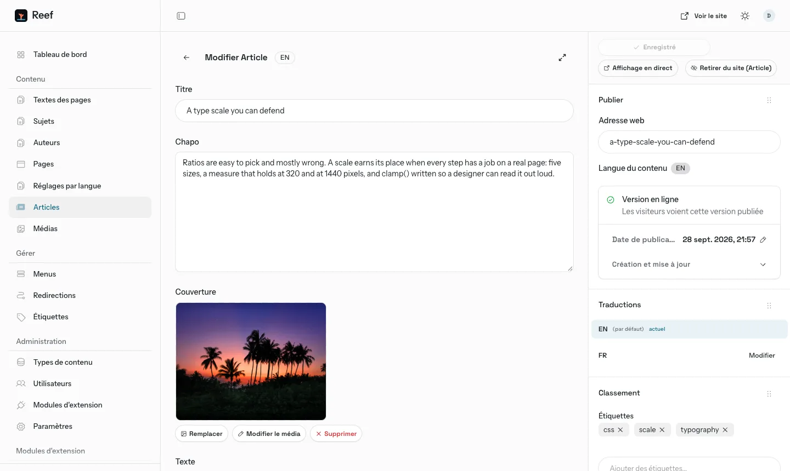
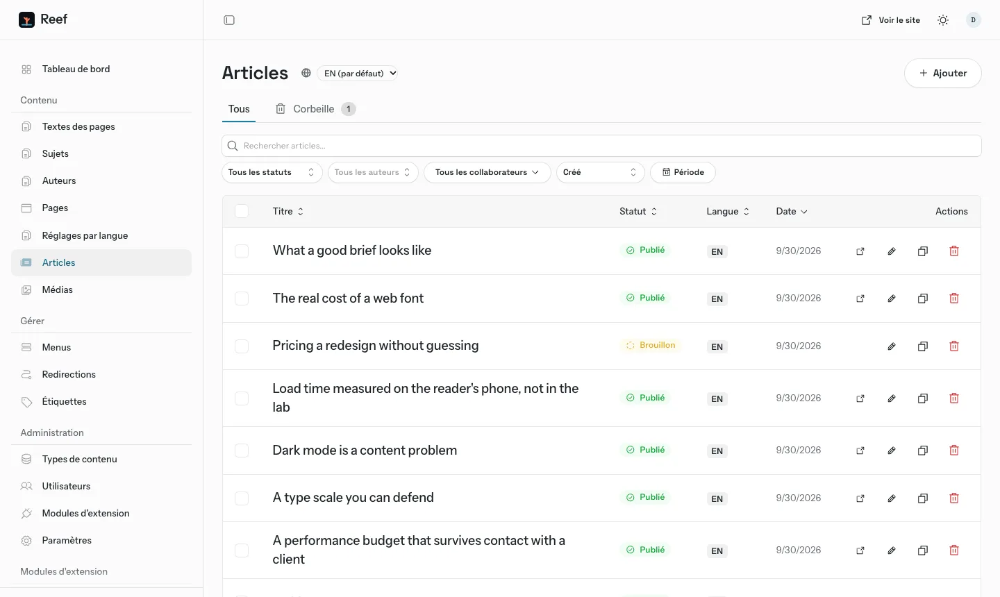

<!-- README.md - the front page of the repo: what Reef is, how to run it, the back office, deployment, the native app, the licence. -->

<p align="center">
  
</p>

<h1 align="center">Reef</h1>

<p align="center">
  <b>A sober, bilingual blog for Astro 7, with a real blog CMS when you want one.</b><br>
  Plain static HTML by default. Switch on the optional EmDash engine and the whole site<br>
  is written, scheduled, sent and arranged from its back office.
</p>

<p align="center">
  <a href="https://reef.alohapixel.app"><b>Live demo</b></a>
  &nbsp;·&nbsp;
  <a href="https://reef.alohapixel.app/fr/">Version française</a>
  &nbsp;·&nbsp;
  <a href="#quick-start">Quick start</a>
  &nbsp;·&nbsp;
  <a href="https://alohapixel.app/themes/">The rest of the family</a>
</p>

<p align="center">
  
  
  
  
  
</p>

---

Reef is two things from one source, free and MIT licensed.

- **A static blog theme.** `pnpm build` writes plain HTML: a home that leads
  with the latest piece, a paginated blog, topic, tag and author pages, a
  reading column with a table of contents, search, and an RSS feed per
  language, in English and in French. No server, no adapter, no database.
- **A blog CMS.** With `ALOHA_MOTEUR=emdash` the same source builds as a
  Cloudflare Worker on [EmDash](https://github.com/emdash-cms/emdash), the
  MIT-licensed CMS for Astro that runs on Workers, D1 and R2. Posts live in the
  database, a published change shows on the site with no rebuild, and
  everything a reader sees is set from the back office at `/_emdash/admin`.
  The live demo runs this way.

The demo publication is Reef Notes, the notebook of a fictional web studio.
Every word lives in the back office, in a typed dictionary or in a Markdown
post, never inside a component.

## The blog CMS

What a writer expects from a blogging platform, with the engine on.

<p align="center">
  
</p>

| You want to | Where, in the back office |
|---|---|
| Write, keep drafts, schedule, go back to a revision | « Articles »: title, lead, cover, rich text with headings, lists, quotes, code, images and tables; « Enregistrer » keeps a draft, « Publier » puts it live, « Programmer » picks a date and time |
| Duplicate or delete a post | The list of posts: « Dupliquer » makes a draft copy, « Déplacer vers la corbeille » removes it, the « Corbeille » tab restores it |
| Sort posts into topics and tags | One topic per post, picked by name; tags are typed in the post's « Classement » panel, renamed in « Étiquettes », and each has its own page at `/tags/<tag>/` |
| Show authors | « Auteurs »: name, role, bio, portrait, links, one page each; a post picks its author by name |
| Search engines and social cards | Each post, page, topic and author has an « SEO » panel: title, description, share image, canonical address, noindex |
| A newsletter, with no outside service | Double opt-in signup on the site, the subscriber list in « Lettre d'information », one click sends a published post to every subscriber in their language, unsubscribe through a confirmation page |
| Contact form emails | The « Courriels » screens send and log every message, through the Worker's Cloudflare email binding |
| Pages and menus | « Pages » for free pages, « Menus » for the main bar, the phone menu, the buttons and the three footer columns, per language |
| Identity and look | « Paramètres »: site name, logo, favicon, social links, posts per page; « Réglages par langue »: description, contact details, typeface, brand colour, logo for dark mode |
| Arrange the home page | Each of the eight home blocks can be hidden or moved |
| Redirects and media | « Redirections » (301, 410), and the media library, stored in R2 |
| RSS and sitemap | One feed per language, and a sitemap that keeps itself up to date |

<p align="center">
  
</p>

Every field says, in one sentence above it, what it changes, and an empty
field renders the theme as shipped. The back office opens in French, and
each person can switch it to English. Comments are not part of the theme.

The editor's guide, for someone who never opens the code:
[docs/administer.md](docs/administer.md) (English) and
[docs/administrer.md](docs/administrer.md) (French).

## Quick start

```bash
pnpm install
pnpm dev        # http://localhost:4321
```

Node 22.18 or later and pnpm. `pnpm dev` first fetches the demo photographs
into `src/assets/`, because the repository does not store them.

```bash
pnpm dev            # dev server
pnpm build          # static site into dist/
pnpm preview        # serve the build locally
pnpm check          # astro check: types and templates
pnpm test           # the selfchecks, plain Node, no framework
pnpm lint:house     # the mechanical house rules
pnpm rebrand "#7a59ff"   # repaint the theme from one brand colour
pnpm rebrand --restore   # back to the Reef palette
pnpm app            # the build for a native Capacitor app
pnpm dev:moteur     # the same site with the publication engine on
pnpm build:moteur   # the Worker build of the engine
```

## The back office, locally

```bash
pnpm dev:moteur                                              # http://localhost:4321/_emdash/admin
node scripts/moteur-import.mjs --url http://localhost:4321   # pours the demo posts into the database, once
```

The first visit to `/_emdash/admin` opens EmDash's setup: the site title,
then an administrator account with a passkey, and the schema and demo texts
of `seed/seed.json`. Locally,
`/_emdash/api/setup/dev-bypass?redirect=/_emdash/admin` skips the account
step. With the engine off, nothing of it is bundled: the static build does
not change.

How the engine is wired (the two sources of posts, the managed pages, the
caches, the back office language): [docs/moteur.md](docs/moteur.md).

## Deploy

**Static.** Upload `dist/` to any static host: Cloudflare Pages or Workers,
Netlify, Vercel, an nginx box. `npx wrangler deploy` publishes it as a
Cloudflare Worker with static assets (`wrangler.toml`: the visitor's
language, the sitemaps, the 404 page). No environment variable is required.

**With the engine.** Two Cloudflare Workers: the engine (EmDash, D1, R2),
and a light front Worker that serves the pages already built and keeps the
others in cache. [DEPLOY.md](DEPLOY.md) walks through the first deployment,
the updates, and rolling back.

**Updating a site already online.** Each version that changes the database
ships one SQL file in `migrations/`, applied in order by
`node scripts/base-3.4.0.mjs`: it shows the plan first, never deletes
anything, and a second run changes nothing. The list is in DEPLOY.md.

## A native app (Capacitor)

The static build has no server, no external CDN and local fonts, which is
what Capacitor wraps. Fixed elements respect the safe areas, heights use
`svh`, touch targets are 44 px, and no page scrolls sideways at 390 px.

```bash
pnpm add @capacitor/core @capacitor/ios @capacitor/android
pnpm add -D @capacitor/cli
pnpm app              # dist/, tuned for a native shell
npx cap add ios       # once (and: npx cap add android)
npx cap sync          # after every pnpm app
npx cap open ios      # Xcode: signing, then the App Store
```

`capacitor.config.ts` ships with the theme: change `appId` and `appName`
before the first `cap add`. The app carries the static build, so its posts
are the Markdown files of `src/data/`, not the back office. Signing, icons,
store review: [wiki/subsystems/mobile-app.md](wiki/subsystems/mobile-app.md).

## Make it yours

1. `src/config/siteData.json.ts`: name, title, description, author.
2. `astro.config.mjs`: `site`, your production address (canonical links,
   share cards, sitemap, robots.txt, RSS).
3. `pnpm rebrand "#yourcolour"`.
4. `src/data/`: your posts (one Markdown file per language, same name),
   authors and topics.
5. `src/i18n/ui/en/` and `src/i18n/ui/fr/`: every word of the interface.
6. `src/config/navData.json.ts` and `legalData.json.ts`: your links, your
   privacy and terms pages.

With the engine on, the same changes are made in the back office instead.

## Before you deploy

- [ ] `site` in `astro.config.mjs` is your real address.
- [ ] `demoNotice` in `src/config/siteData.json.ts` is empty, so the footer
      line saying the site is a demo does not show.
- [ ] The share card is your photograph: `scripts/og.mjs` crops it from the
      home page photo at build time.
- [ ] The legal pages (`src/config/legalData.json.ts`, and the bracketed
      fields of the legal notice in `src/i18n/ui/*/pages.ts`) are read by
      someone qualified. They are a starting point, not legal advice.
- [ ] The contact form points at your endpoint, or at the « Courriels »
      screens with the engine on. It ships with no `action`.
- [ ] `pnpm check`, `pnpm test` and `pnpm build` are green.

## Why it feels expensive

- **Almost no JavaScript.** Dialogs are native `<dialog>`, accordions native
  `<details>`, the marquee is CSS. The scripts that ship are the phone menu,
  the theme switch, the shrinking navbar and the table of contents.
- **A design system, not a stylesheet.** `src/styles/tokens.css` holds the
  palette, the roles and the utilities; markup only speaks roles, so one
  command repaints the theme, the favicon and the share cards.
- **An owned SEO layer.** Canonical links, Open Graph, JSON-LD, robots.txt,
  llms.txt, RSS and the sitemap are readable files in the repo, not a plugin.
- **Light and dark, both composed.** The theme switches before first paint,
  with no flash, and dark mode trades cast shadows for luminous borders.
- **Bilingual by construction.** One page source per route, one post file per
  language, and a typed dictionary: a missing French key fails the build.
- **Accessible.** 44 px touch targets, visible focus, correct ARIA, reduced
  motion honoured by the CSS and by the scroll timelines.

## Structure

```text
src/
  components/   ui/ (the primitives), Sections/ (by page), Cards/, svg/icons/
  config/       typed site data: siteData, navData, legalData
  data/         the demo content: posts (Markdown), authors and topics (JSON)
  i18n/         the bilingual layer and its en/ and fr/ dictionaries
  js/           pure logic: JSON-LD, pagination, addresses, text
  layouts/      BaseLayout and BaseHead (the whole <head>)
  moteur/       the optional publication engine and its back office
  pages/        [...locale]/ routes, 404, robots.txt, llms.txt, rss.xml
  styles/       tokens.css, global.css, prose.css, the motion catalogue
migrations/     the SQL that brings a database online to the current version
scripts/        build steps (photos, share cards, favicon), rebrand, app, engine tools, checks
seed/           seed.json: the engine's schema and first content
docs/           the editor's guide, the engine, the design, the conventions
wiki/           how each subsystem works, anchored to the code
```

## Documentation

- [docs/administer.md](docs/administer.md) and [docs/administrer.md](docs/administrer.md): running the site from the back office.
- [docs/moteur.md](docs/moteur.md): the publication engine.
- [DEPLOY.md](DEPLOY.md): static hosting, the engine online, updates.
- [docs/design.md](docs/design.md) and [docs/conventions/](docs/conventions/): the design rules and the code conventions.
- [wiki/overview.md](wiki/overview.md): the architecture, then one page per subsystem.
- [AGENTS.md](AGENTS.md): the working rules of the repository, for people and for coding assistants.
- [CHANGELOG.md](CHANGELOG.md): what changed, version by version.

## Support

Issues are closed on purpose: support lives in one place.
Write to https://alohapixel.app/contact/. Pull requests are welcome.

Reef is the free member of a family of seven themes built on the same
foundation; the others add a shop, a SaaS site with its dashboard, a launch
page, a portfolio: https://alohapixel.app/themes/

## Licence

MIT, full text in [LICENSE](LICENSE). Use it, fork it, sell what you build
with it, no attribution required.

The ten demo photographs come from Pexels and carry the Pexels licence (free
for commercial use, no attribution required): [NOTICE.md](NOTICE.md) and
[PHOTOS.md](PHOTOS.md). Fonts and packages are listed in
[THIRD-PARTY.md](THIRD-PARTY.md).
